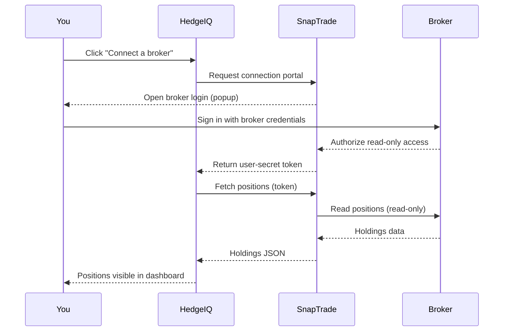

# Connecting your broker

This is the most important page in the help center. Connecting a broker is what turns HedgeIQ from a demo into something useful — the moment your real positions appear in the dashboard, the rest of the product makes sense.

## How HedgeIQ talks to your broker

HedgeIQ uses [SnapTrade](https://snaptrade.com), a regulated financial-data aggregator, to connect to your brokerage. **Your credentials never touch our servers.** They go from you to your broker through SnapTrade's secure popup, and SnapTrade returns a token that lets us see — but not move — your positions.

The whole flow takes about thirty seconds.

## Step by step

### 1. From the dashboard, click "Connect a broker"

If you have no brokers connected yet, the positions panel shows a large empty state with a primary button labeled **Connect a broker**. If you've already connected one and want to add another, the same button is in **Settings → Connected brokers**.

### 2. Choose your broker

A grid of broker logos appears in a popup window. The list is filterable by region and by asset class (stocks, options, crypto). Click yours.

If you don't see your broker, see the [supported brokers page](/help/10-supported-brokers) for the full list, and email us if it's missing entirely.

### 3. SnapTrade opens your broker's login

A new popup window opens to your broker's actual login page (or to an OAuth consent screen, depending on the broker). **The URL bar will show your broker's domain.** This is real — not a HedgeIQ-controlled page mocked up to look like your broker. SnapTrade and your broker have negotiated this flow specifically so you stay on the broker's domain when you type your password.

### 4. Authorize read-only access

After you sign in, your broker shows you a consent screen: *"Allow HedgeIQ (via SnapTrade) to view your account positions, balances, and order history?"* You confirm. Most brokers explicitly call out **read-only** in this dialog — that's the only kind of access we ask for. We can't place trades, we can't transfer money, and we can't change account settings.

### 5. SnapTrade returns a connection token

The popup closes. Behind the scenes, SnapTrade hands HedgeIQ a token that's tied to *your* HedgeIQ account and *your* broker connection. We store that token (not your password) and use it to ask SnapTrade for position data.

### 6. Your positions appear within 30 seconds

The first sync usually completes in 10–20 seconds for a typical account. Larger accounts (hundreds of positions) can take up to a minute. The positions panel will populate, the market tape across the top will start moving, and you're done.

## Per-broker tips

Different brokers have slightly different quirks. Here's what to expect from the most common ones.

### Robinhood

Robinhood requires SMS verification on every new device. When the popup opens you'll be asked for the code from your phone. It's not a HedgeIQ-specific thing — Robinhood does the same when you log in from a new browser yourself. Have your phone handy.

After verification, Robinhood will keep the SnapTrade connection alive for ~90 days before re-authentication is required.

### Fidelity

Fidelity uses **Plaid** for OAuth (not SnapTrade-direct). When you click Fidelity, the popup will say *"Powered by Plaid"* — that's expected. Sign in with your normal Fidelity credentials and authorize the connection. The flow is identical from your end; the difference is just which aggregator handles the bridge.

If you have multiple Fidelity accounts under one login, they'll all show up. You can hide individual ones from **Settings → Connected brokers**.

### Interactive Brokers (IBKR)

IBKR is the most powerful broker on the list, and the one with the most setup. Before connecting, you need to enable **Read-Only API access** in IBKR Client Portal:

1. Sign into Client Portal → Settings → Account Settings → API.
2. Find "Settings" → "API → Settings."
3. Enable "Read-Only API."
4. Save.

Then connect via SnapTrade. The popup will ask for your IBKR username/password and a 2FA code. IBKR is strict about session expiry — you'll typically need to re-auth every 30 days.

### Public

Public uses standard OAuth 2.0 — straightforward. You'll see a Public-branded consent screen, click authorize, and you're back. Connection lifetime is roughly 60 days.

### Webull

Webull requires the **mobile app to be installed and signed in** on your phone. The desktop OAuth flow uses your phone for confirmation (similar to how some bank logins work). When the popup opens, check your Webull app — there'll be a notification asking you to approve the connection. Tap approve and the popup closes.

If the notification doesn't arrive, force-close and reopen the Webull app and try again.

### E\*TRADE

Standard OAuth. Sign in with your Power E\*TRADE credentials, click authorize, you're back. E\*TRADE tokens are valid for 90 days.

### TastyTrade

TastyTrade is the only broker on the list that uses **credentials-based** authentication instead of OAuth. SnapTrade asks for your TastyTrade username and password directly. SnapTrade stores them encrypted at rest and uses them to log in on your behalf.

This is less ideal than OAuth from a "minimum trust" perspective, but it's the only thing TastyTrade currently offers. If that bothers you, consider switching to a broker that supports OAuth — most do.

### Vanguard

Vanguard has very limited support. Mutual-fund-only Vanguard accounts work; brokerage accounts work for read-only positions but options data may lag. Vanguard hasn't published a modern API and SnapTrade is using a brittle integration. If your Vanguard connection breaks, please email us; we'll log it with SnapTrade.

### Charles Schwab

Full support. Standard OAuth. After the recent TD Ameritrade migration, Schwab uses a unified login — your old TDA account credentials should now work as Schwab credentials. The first connection takes a minute or two longer than other brokers because Schwab's positions API is paginated.

## Frequently asked questions

### What if my broker isn't listed?

Check the full list at [/help/10-supported-brokers](/help/10-supported-brokers). If it's not there either, email [contact@hedgeiq.app](mailto:contact@hedgeiq.app) with your broker name and we'll request it from SnapTrade. New broker integrations are added every few months.

### Can I disconnect a broker?

Yes. Go to **Settings → Connected brokers**, find the broker in the list, and click **Disconnect**. This revokes the SnapTrade token and removes the broker's positions from your dashboard. If you want to re-connect later, you'll go through the OAuth flow again.

You can also revoke access from your broker's website (look for "Connected apps" or "Authorized applications" in your broker's account settings). Doing it from the broker side is the strongest revocation — it kills the token at the source.

### Is this really read-only?

Yes. SnapTrade negotiates read-only OAuth scopes with every broker. HedgeIQ does not have any code path that submits orders. We don't even have an "execute trade" button anywhere in the product. If you ever want to place a trade based on what you see in HedgeIQ, you have to do it in your broker's app.

### How often do positions refresh?

Automatically every 30 seconds while the dashboard is open. You can also force a refresh by clicking the refresh icon in the positions panel header.

Some brokers (notably IBKR) rate-limit aggregators, so during heavy market hours you may see a slightly stale price for a minute or two. The total P&L will still be accurate; intraday price ticks come from our market-data provider (Polygon), not from your broker.

### Can I connect multiple accounts at the same broker?

Yes. Most brokers will return all accounts under your login. They'll all appear in the positions table tagged with the account name. You can filter by account from the positions table header.

### What data does HedgeIQ store?

We store: the SnapTrade token, your positions (symbol, quantity, cost basis, current price), and your account names. We don't store your social security number, your bank routing info, or anything else SnapTrade has access to that we don't need.

See the [security page](/security) and the [privacy policy](/privacy) for the full list.
