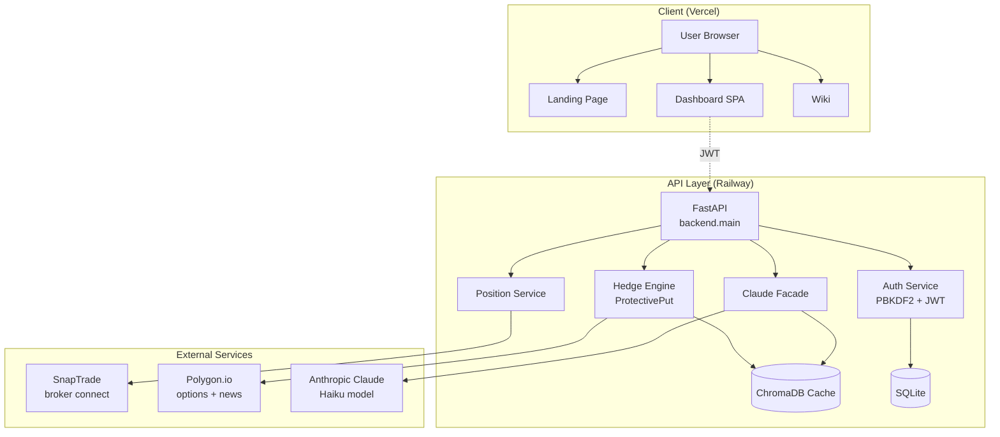
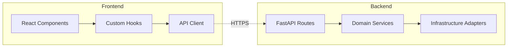
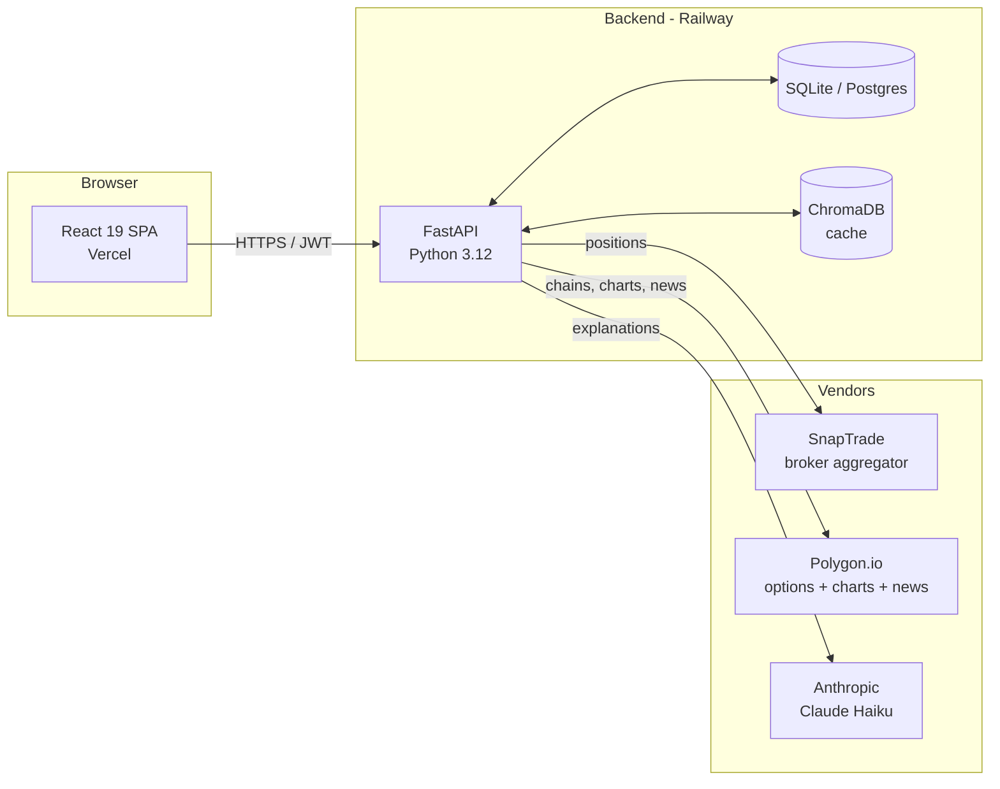
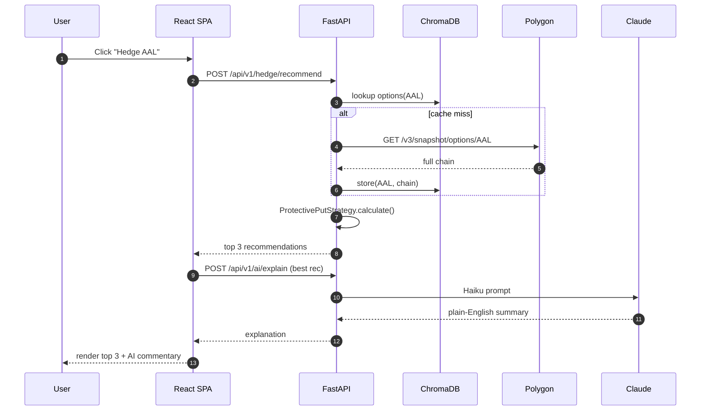

# 02 — Architecture

## System architecture



## Component layering



## Vendor + data flow



## Backend layers

The backend follows a hex-style layout under `backend/`:

```
backend/
├── main.py                # FastAPI app, middleware, lifespan
├── config.py              # Pydantic settings
├── api/
│   ├── v1/                # HTTP endpoints (auth, positions, options, hedge, ai, quotes)
│   ├── bff/               # web/mobile/desktop bff variants
│   └── gateway/           # rate limiter, api-key auth, middleware
├── domain/                # Pure business logic — no I/O
│   ├── positions/         # Position models, repository interface, service
│   ├── options/           # OptionContract, repository interface, service
│   ├── hedging/           # HedgeRecommendation + strategies (ProtectivePut, Collar)
│   ├── analysis/          # AI helper service
│   └── common/            # Money, ticker, errors
├── infrastructure/        # Concrete adapters to vendors
│   ├── snaptrade/         # SnapTrade SDK facade
│   ├── polygon/           # Polygon REST facade + repository implementation
│   ├── claude/            # Anthropic SDK facade with prompt templates
│   └── cache/             # ChromaDB cache for options chains and AI responses
├── adapters/              # Per-broker adapters used by SnapTrade facade
│   ├── fidelity_adapter.py
│   ├── ibkr_adapter.py
│   ├── public_adapter.py
│   └── robinhood_adapter.py
└── db/
    ├── models.py          # SQLAlchemy ORM
    ├── session.py         # session factory + init_db / check_db
    └── migrations/        # Alembic
```

### Layer rules

- `domain/` imports nothing from `infrastructure/` or `api/` — it's pure logic that we can unit-test in milliseconds.
- `infrastructure/` implements the repository interfaces declared by `domain/`.
- `api/v1/` is thin: parse request, dispatch to a domain service, serialise response.
- `main.py` is the only place where the wiring happens (router registration, middleware order).

## Frontend structure

```
frontend/src/
├── App.tsx                # Router
├── main.tsx               # Entry point
├── components/
│   ├── Dashboard.tsx      # Authenticated orchestrator
│   ├── AIChat.tsx         # Claude chat panel
│   ├── OptionsChain.tsx   # Filterable chain
│   ├── EmergencyHedge.tsx # The 60-second hedge dialog
│   ├── PositionsTable.tsx # Live positions
│   ├── PriceChart.tsx     # Polygon-backed OHLC
│   ├── LandingPage.tsx    # Public marketing
│   └── LoginPage.tsx
├── lib/
│   ├── api.ts             # fetch wrapper + JWT injector
│   ├── ThemeProvider.tsx  # 3 themes × 2 densities × colour-blind
│   ├── icons.tsx          # Iconography facade
│   └── layout-store.ts    # Persisted dashboard layout
└── widgets/               # Pluggable dashboard widgets
```

## Request flow — emergency hedge



## Data flow guarantees

- All vendor calls are wrapped in a try/except that downgrades to mock data if the vendor is down — the user gets a labelled "demo" response rather than a 500.
- All authenticated endpoints validate the JWT *before* hitting infrastructure.
- All ChromaDB writes are best-effort; cache failures are logged but never propagate to the client.
