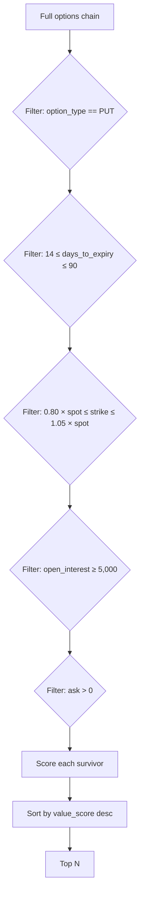

# 07 — Hedge algorithm

The core of HedgeIQ is `ProtectivePutStrategy` — a deterministic ranking algorithm that selects the best protective puts from an options chain, given a long stock position.

## Inputs

- `position: Position` — the stock holding to hedge.
- `options_chain: list[OptionContract]` — full chain for the underlying, freshly fetched from Polygon (or cached).
- `num_recommendations: int = 3` — how many to return.

## Pipeline



### Filter constants

```python
MIN_OI = 5_000
MIN_DAYS = 14
MAX_DAYS = 90
MIN_STRIKE_PCT = Decimal("0.80")
MAX_STRIKE_PCT = Decimal("1.05")
SHARES_PER_CONTRACT = 100
```

These came from observing real Fidelity options chains: liquidity below 5,000 OI typically has wide bid-ask spreads (>10%) that make execution painful; expiries below 14 days are gamma-heavy and often blow through the breakeven on a single bad day; expiries beyond 90 days cost too much premium to be a *quick* hedge.

## Scoring

For every surviving contract:

```
contracts_to_buy = ceil(position.quantity / 100)        # full coverage
total_cost       = ask * 100 * contracts_to_buy
breakeven        = strike - ask
drop_10_price    = position.current_price * 0.90
coverage         = max(0, (strike - drop_10_price - ask)) * 100 * contracts_to_buy
value_score      = coverage / total_cost
```

The contract with the highest `value_score` is the cheapest dollar-of-protection per dollar-of-premium *at a 10% drawdown*. We chose 10% because it's:

1. A meaningful "bad day" — well outside normal daily moves on most large-caps.
2. Painful but not catastrophic — most real-world events hedge users care about (earnings, sector shocks, geopolitics) cluster in the 5–15% range.
3. Stable across IV regimes — using a fixed percentage rather than a sigma-based threshold keeps the scoring intuitive.

## Worked example — the AAL story

**Input**

- Position: 5,000 shares AAL @ avg cost $4.71, current price **$12.84**.
- Date: today.

**Strike window**

- Min strike: 12.84 × 0.80 = **$10.27**
- Max strike: 12.84 × 1.05 = **$13.48**

**Expiry window**: today+14 to today+90.

Suppose the chain has these candidates after filtering:

| Strike | Expiry | Ask | OI |
|--------|--------|-----|----|
| 10.50  | +28d   | 0.18 | 7,200 |
| 12.00  | +28d   | 0.55 | 12,400 |
| 13.00  | +28d   | 1.25 | 9,800 |

**Score each**

`drop_10_price = 12.84 * 0.90 = 11.556`
`contracts = 50` (5,000 / 100)

- **Strike 10.50**: `coverage = max(0, 10.50 - 11.556 - 0.18) * 100 * 50 = 0` (out-of-the-money even at the drop). value_score = 0.
- **Strike 12.00**: `coverage = (12.00 - 11.556 - 0.55) * 100 * 50` — but `12.00 - 11.556 = 0.444 < ask 0.55`, so coverage = 0. value_score = 0.
- **Strike 13.00**: `coverage = (13.00 - 11.556 - 1.25) * 100 * 50 = 0.194 * 5000 = $970`. `total_cost = 1.25 * 100 * 50 = $6,250`. `value_score = 970 / 6,250 = 0.155`.

**Result**: the $13.00 put is the only contract that actually pays out at a 10% drop, and the algorithm correctly ranks it #1.

If we widen the scenario to a 15% drop, the $12.00 put starts paying. The frontend shows three scenarios side-by-side so the user can pick the strike that matches their fear.

## Why not Black-Scholes / Greeks?

We deliberately avoid any IV-surface modelling at this stage:

- The user's question is *"which contract should I buy right now?"*, not *"is this contract correctly priced?"*.
- Polygon's quoted ask is the price the user actually pays; using a theoretical price would be misleading.
- Greeks are useful for managing existing positions, not initial selection.

A future Phase 3 may add a Greeks-aware "delta-target" strategy as an alternative to value-score.

## Edge cases

| Case | Behaviour |
|------|-----------|
| No puts pass filters | `InsufficientLiquidityError` → 422 with explanatory detail. |
| Position quantity not a multiple of 100 | Round up `contracts_to_buy`; user is over-hedged on the last 99 shares (acceptable). |
| All puts are OTM at 10% drop | All `value_score == 0`; the algorithm still returns top 3 sorted by `total_cost` ascending so the user sees *cheapest available coverage*. |
| Spot price is stale | We treat what Polygon returns as authoritative; the frontend shows the timestamp. |
