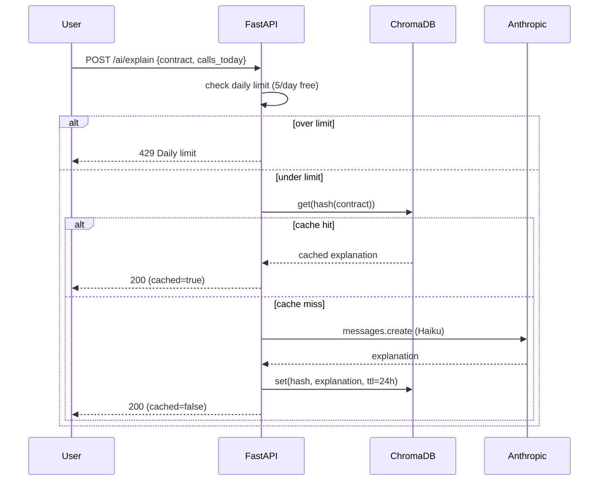

# 08 — AI integration

<figure>
  
  <figcaption>AI Advisor with streaming responses</figcaption>
</figure>

HedgeIQ uses **Anthropic Claude Haiku** for plain-English explanations and lightweight chat. Claude is never used for the actual hedge calculation — that is deterministic Python (see [07](07-hedge-algorithm.md)). Claude's role is *translation*: turning numbers into a sentence the user can act on.

## Request + cache flow



## Why Haiku

- Cheap (well under $1 per 1,000 explanations at our prompt sizes).
- Fast (sub-1 second p50 for the prompts we send).
- Good enough — the prompts are tightly scoped; we don't need Sonnet's reasoning headroom.

## Where it lives

`backend/infrastructure/claude/facade.py` is the single entry point. It exposes:

```python
class ClaudeFacade:
    async def explain_recommendation(rec: HedgeRecommendation, position: Position) -> str
    async def chat(messages: list[Message], system: str | None = None) -> str
    async def explain_chart(symbol: str, news_snippets: list[str]) -> str
```

All three methods enforce daily-limit accounting before issuing the API call.

## Prompt templates

Templates are kept as constants in `prompts/` (top-level dir, version-controlled). Examples:

### `explain_recommendation` (system + user)

```
SYSTEM:
You are HedgeIQ, a calm, plain-English options assistant for retail
investors. You never give specific trade advice. Use 2-3 short sentences.
Never use jargon without defining it.

USER:
The user holds {quantity} shares of {symbol} at ${current_price:.2f}.
The recommended hedge is the {strike} {expiry} put for ${ask:.2f}.
Buying {contracts} contracts costs ${total_cost:.2f} and breaks even
at ${breakeven_price:.2f}. At a 10% drop, the put pays {coverage:.0f}.
Explain to the user, in 2-3 sentences, what this means and what their
worst-case loss is.
```

### `chat` (system)

```
You are HedgeIQ. Help the user think clearly about their portfolio. You
have read-only access to their positions. You never recommend specific
trades. If asked, redirect to the hedge calculator.
```

## Daily limits

| Tier | Calls / day |
|------|-------------|
| Free | 10 |
| Pro  | 100 |
| Admin | unlimited |

The counter is on `users.daily_ai_calls_used` and is reset by `users.daily_ai_reset_date`. Hitting the limit raises `DailyLimitExceededError` → 429.

## Caching

Identical prompts within a 1-hour window are served from ChromaDB rather than re-calling the API. Cache key is a SHA-256 of `(template_name, user_id, sorted_args)`. We cache *responses*, not embeddings — the cache is just a deterministic map. ChromaDB is convenient because it gives us TTL + metadata filtering for free.

## Failure modes

| Failure | Behaviour |
|---------|-----------|
| Anthropic 5xx | Fall back to a templated explanation generated from the recommendation fields. User sees a clearly-labelled "AI offline" banner. |
| Anthropic 429 (org-level) | Same as 5xx. |
| Rate-limit per user | 429 with `Retry-After` header. |
| Prompt > 4k tokens (chat history) | Trim oldest messages. |
