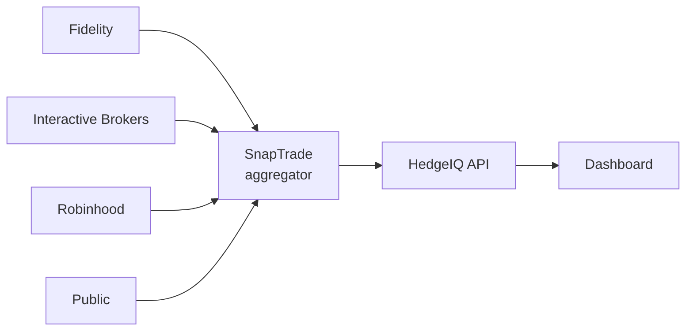
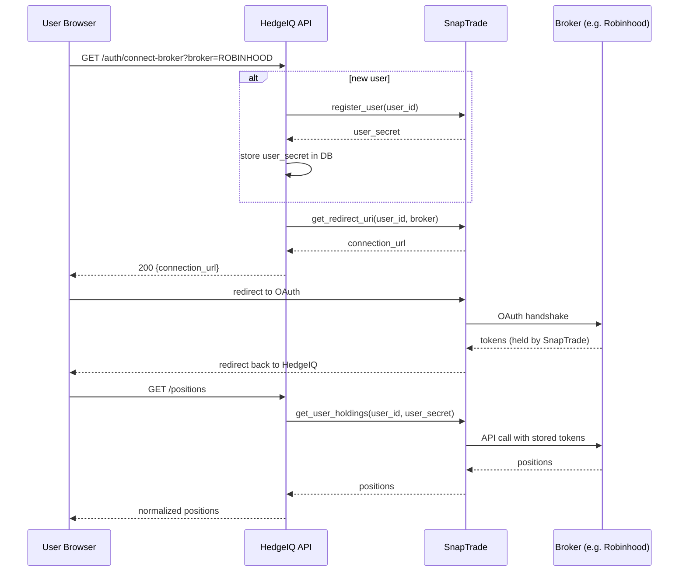
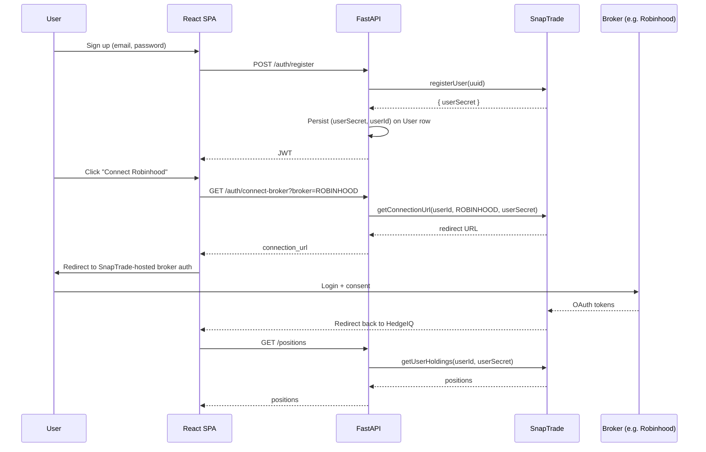

# 09 — Broker integration

HedgeIQ doesn't connect to brokers directly — it uses **SnapTrade** as a single OAuth-style aggregator. Today four brokers are supported: Fidelity, Interactive Brokers, Robinhood, Public.

## Broker fan-in



## End-to-end OAuth + positions



## The flow



## Per-user secret model

Earlier versions of HedgeIQ used a *single* admin SnapTrade secret for all users — fine for the founder, broken for production. The current model:

- On `register`, the backend calls SnapTrade to register the user and stores the returned **per-user secret** on the `users` row.
- All subsequent SnapTrade calls pass that user's own secret.
- We never fall back to the admin secret for a non-admin user (commit `d5ce622`).

## Adapter pattern

Inside `backend/adapters/` each broker has a thin adapter:

```python
class FidelityAdapter(BaseAdapter):
    name = "FIDELITY"
    def normalise_position(raw: dict) -> Position: ...
```

The adapters exist so that broker-specific quirks (Fidelity returns `mktVal` not `marketValue`, Robinhood uses lowercase symbols) are isolated from the SnapTrade facade.

The facade (`infrastructure/snaptrade/facade.py`) is the single place where `snaptrade-python-sdk` is imported. It registers users, generates OAuth URLs and reads holdings.

## Mock fallback

If SnapTrade is unreachable (network, 5xx, missing keys), every adapter falls back to a deterministic mock that returns:

- A handful of realistic positions (AAL, NVDA, AAPL).
- A "demo data — connect a broker" banner sent in the response headers (`X-Data-Source: mock`).

This way the local dev experience and reviewer demos never break on vendor outages.

## Disconnecting a broker

Users can revoke a connection from the dashboard → Preferences → Connected accounts → Disconnect. The backend calls `SnapTrade.deleteConnection(userId, connectionId, userSecret)` and clears the cached positions.

## Data freshness

SnapTrade caches broker data for up to 60 seconds. Our `/positions` endpoint adds another 30s of in-memory caching keyed by `(user_id, symbol)`. So worst-case, positions can be ~90 seconds stale. The frontend shows the data timestamp.
