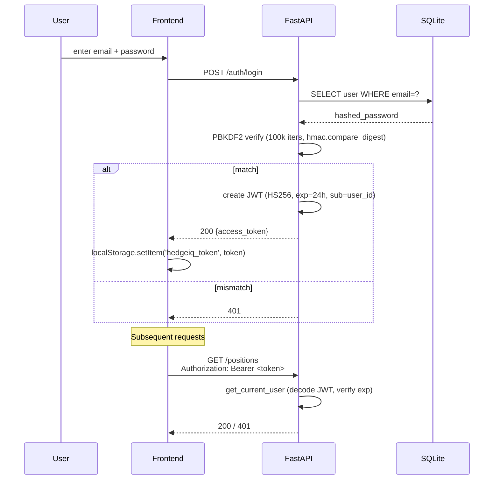
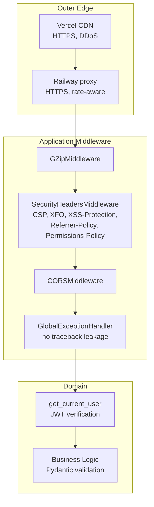

# 11 — Security

HedgeIQ handles brokerage account credentials (indirectly via SnapTrade), live position data and an LLM prompt surface. Security is non-negotiable.

## Auth + JWT lifecycle

## Defense-in-depth

## Authentication

### Password storage

- **PBKDF2-HMAC-SHA256**, 100,000 iterations, 16-byte random salt per password.
- Implemented in `backend/api/v1/auth.py::_hash_pw` using only `hashlib` from the standard library — no C extensions, so the Railway container is small and free of build-time pain.
- Stored as `"<salt_hex>:<dk_hex>"` on `users.hashed_password`.

### Token model

- HS256 JWT signed with `settings.secret_key`.
- Claims: `sub` (user UUID), `iat`, `exp` (24 h).
- No PII in claims — clients fetch profile data via authenticated endpoints.
- Verified via `backend/api/v1/auth.py::get_current_user` (FastAPI dependency).
- Expired tokens → 401 with `detail: "Token expired"`. Invalid signature → 401 with `detail: "Invalid token"`.

### Login flow

1. Client posts email + password.
2. We look the user up by lowercase email.
3. `hmac.compare_digest` verifies the PBKDF2 hash (constant-time).
4. On success, we issue a fresh JWT.
5. Admin credentials from env are honoured as a one-time fallback for ops emergencies.

## Transport

- HTTPS only (Railway / Vercel both terminate TLS at the edge).
- `Strict-Transport-Security` is enforced by Railway for the API host.
- We never accept credentials over plain HTTP.

## Security headers

`SecurityHeadersMiddleware` (in `backend/main.py`) sets, on every response:

| Header | Value |
|--------|-------|
| `X-Content-Type-Options` | `nosniff` |
| `X-Frame-Options` | `DENY` |
| `X-XSS-Protection` | `1; mode=block` |
| `Referrer-Policy` | `strict-origin-when-cross-origin` |
| `Permissions-Policy` | `camera=(), microphone=(), geolocation=()` |
| `Content-Security-Policy` | strict — only self + Anthropic + SnapTrade + Polygon |

CSP details — only outbound origins we actually call are whitelisted under `connect-src`. No third-party scripts are loaded; no `frame-ancestors` allowed.

## Rate limiting

- `backend/api/gateway/rate_limiter.py` provides per-IP and per-user rate limits using a sliding-window in-memory store.
- AI endpoints additionally enforce the per-user daily quota (see [08-ai-integration.md](08-ai-integration.md)).

## Data isolation

- All queries that read user-owned rows filter by `current_user.id`. No global "list all positions" queries exist server-side.
- SnapTrade calls use the *user's own* per-user secret; we never substitute admin credentials for non-admins (commit `d5ce622`).
- Tests in `backend/tests/integration/test_api_endpoints.py` assert that user A cannot read user B's positions even with a forged JWT (signature check fails first, but the ownership check is double-belt).

## Input validation

- All request bodies are Pydantic models with explicit types and constraints. Unknown fields are rejected (default `extra="forbid"` on the schemas).
- SQL injection: we use SQLAlchemy ORM exclusively; no raw string-formatted SQL. `test_sql_injection_in_email_does_not_crash` exercises the hot path.
- Prompt injection: the AI facade puts user input strictly inside the *user* role of the message array. The system prompt clamps behaviour ("never give specific trade advice").

## Secrets management

- Local: `.env` ignored by git.
- Railway: encrypted environment variables.
- Vercel: encrypted environment variables for the build.
- `git secrets` patterns scanned in CI (Phase 3 — currently a TODO).

## Known gaps / Phase 3

- CSP `unsafe-inline` for `script-src` is required by Vite dev mode; tighten in prod build.
- No 2FA on accounts yet — tracked in roadmap.
- No audit log table; only structured logs.
